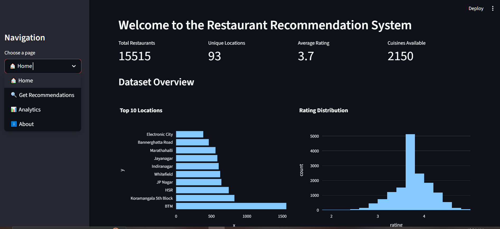
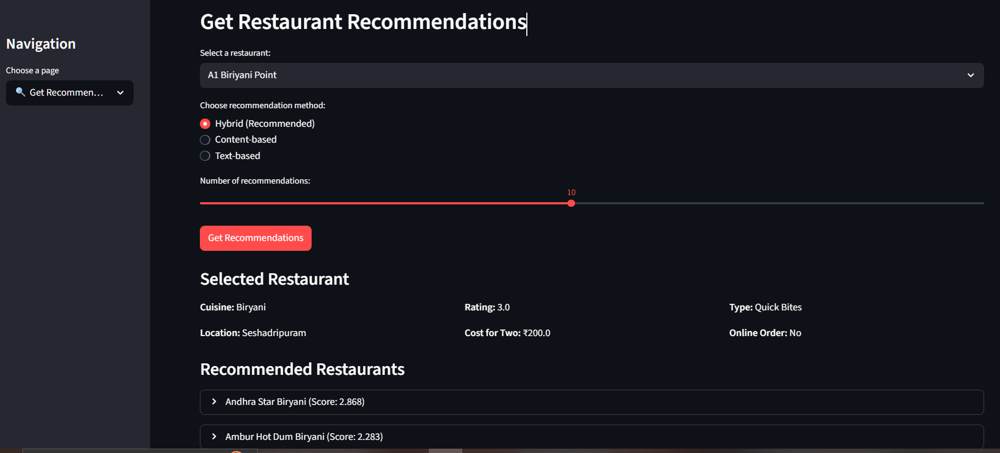
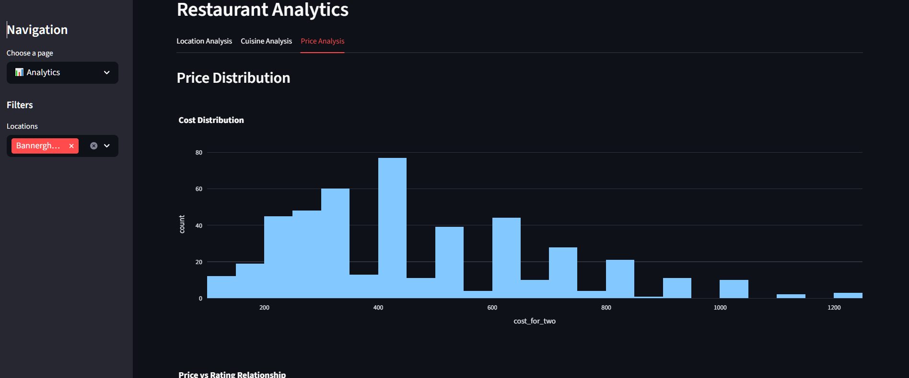

# Restaurant Recommendation System
##  Project Description

This project focuses on building a **restaurant recommendation system** using the Zomato dataset. The goal is to generate personalized restaurant suggestions by experimenting with different **feature engineering** and **modeling techniques**.

Throughout the workflow, multiple approaches were explored to better represent restaurants:

* **Data Cleaning & Preprocessing** → handled missing values, standardized ratings, costs, cuisines, and restaurant types.
* **Feature Engineering** → created both **TF-IDF text features** and **structured embedding text representations** combining cuisines, location, dishes, services, and numerical features (rating, cost, votes).
* **Modeling Approaches** → implemented **content-based**, **text-based**, and **hybrid recommenders**, with an additional embedding pipeline for richer semantic representations.
* **Evaluation** → tested models using **coverage, diversity, similarity metrics**, and **qualitative analysis** on real examples to compare strengths and weaknesses of each approach.

## End-to-End Process (in short)

1. **EDA** → explored dataset, identified missing values, and data distribution.
2. **Feature Engineering** → tried multiple strategies:

   * Traditional TF-IDF features.
   * Structured embedding text combining categorical, numerical, and textual features.
3. **Model Training** → built different recommenders (content, text, hybrid, embedding-ready).
4. **Evaluation** → analyzed performance quantitatively (coverage, diversity, similarity) and qualitatively (manual inspection, error cases).
5. **Outcome** → delivered a flexible **recommendation pipeline** with insights into what works best, and how future improvements (collaborative filtering, embeddings, A/B testing) could be added.
6. **Interactive Web App** → An interactive Streamlit-based web application was built for users to explore restaurants, get recommendations, and visualize analytics.

---

#### Project Structure
```
.
├── README.md
├── streamlit_UI.py
├── uv.lock
├── data/
│   └── zomato.csv
├── models/
│   ├── cuisine_encoder.pkl
│   ├── feature_scaler.pkl
│   ├── restaurant_data_indexed.csv
│   ├── restaurant_embeddings.pkl
│   └── tfidf_vectorizer.pkl
├── notebook/
│   ├── .DS_Store
│   ├── 01_eda.ipynb
│   ├── 02_feature_engineering.ipynb
│   ├── 02_feature_engineering_embedding.ipynb
│   ├── 03_model_training.ipynb
│   ├── 03_model_training_for_embedding.ipynb
│   └── 04_evaluation.ipynb
├── processed_data/
│   ├── content_features.csv
│   ├── hybrid_features.csv
│   ├── processed_restaurant_data.csv
│   ├── restaurants_for_embedding.csv
│   └── text_features.csv
└── src/
    ├── content_base_recommender.py
    ├── hybrid_recommender.py
    ├── recommender.py
    ├── text_based_recommender.py
    └── optimized_test/
        ├── content_base_recommender.py
        ├── hybrid_recommender.py
        ├── recommender.py
        └── text_based_recommender.py
```

---

####  Notebook: `01_eda.ipynb` — Exploratory Data Analysis

**Process:**

1. **Dataset Overview** – Checked size, structure, and missing values.
2. **Univariate Analysis** – Explored distributions of ratings, votes, and cost.
3. **Categorical Analysis** – Reviewed restaurant locations, types, and service availability (online order, table booking).
4. **Cuisine Analysis** – Identified most popular cuisines.
5. **Bivariate Analysis** – Studied relationships between cost, rating, votes, location, and restaurant type.
6. **Correlation & Price Range** – Correlation among numeric features and average rating by price segments.
7. **Key Insights** – Summarized trends in ratings, pricing, services, and cuisines.

**Outcome:**
Initial insights into restaurant data quality, distributions, and relationships to guide feature engineering and modeling.


---

#### Notebook: `02_feature_engineering.ipynb` — Feature Engineering

**Process:**

1. **Data Cleaning** – Standardized ratings, cost, text fields (location, cuisines, rest\_type, etc.), votes, and service flags.
2. **Text Features** – Extracted cuisines, dishes, combined descriptive features, and processed review texts.
3. **Numerical Features** – Imputed missing values, derived interaction features, log-transforms, popularity score, and created price/rating categories with scaling.
4. **Categorical Features** – Encoded locations, restaurant types, cuisines, and service options into structured vectors.
5. **Text Vectorization** – Applied TF-IDF on combined features and reviews.
6. **Feature Matrices** – Built three types of feature sets:

   * **Content-based features** (numerical, categorical, service).
   * **Text-based features** (reviews + descriptive text).
   * **Hybrid features** (numerical + top categories + top cuisines + selected text features).
7. **Data Export** – Saved processed datasets and encoders:

   * `processed_restaurant_data.csv`
   * `content_features.csv`
   * `text_features.csv`
   * `hybrid_features.csv`
   * Pickled objects: `feature_scaler.pkl`, `tfidf_vectorizer.pkl`, `cuisine_encoder.pkl`.

**Outcome:**
A clean, enriched dataset with structured **content, text, and hybrid feature representations**, ready for training recommender models.

---


####  Notebook: `02_feature_engineering_for_embedding.ipynb` — Embedding-Oriented Feature Engineering

**Process:**

1. **Data Sampling & Cleaning**

   * Tested on sample data 30%-70% of Zomato dataset.
   * Standardized and cleaned: `rating`, `cost`, `votes`.
   * Processed categorical text fields: `cuisines`, `location`, `restaurant type`, `dishes liked`.

2. **Unified Embedding Text**

   * Combined multiple attributes into a single descriptive string (`embedding_text`):

     * Cuisines
     * Restaurant type
     * Location
     * Popular dishes
     * Services (online order, table booking)

3. **Numerical Feature Engineering**

   * `rating_normalized` (scaled 0–1).
   * `cost_normalized` (min-max).
   * `votes_normalized` (log + min-max).

4. **Final Embedding Dataset**

   * Selected key columns:

     * `name`, `address`, `location`, `cuisines`, `restaurant_type`, `embedding_text`
     * `rating`, `cost`, `votes` + normalized variants
     * Service flags (`online_order`, `book_table`)
   * Dropped nulls in critical fields (`name`, `embedding_text`).

5. **Output**

   * Exported to:

     * `../processed_data/restaurants_for_embedding.csv`
   * Final dataset: \~30-70% restaurants with **clean text + normalized numerics**, ready for embedding generation.

**Outcome:**
A compact, structured dataset optimized for **embedding-based recommenders**, with one consolidated text field plus normalized numerical features.


---


####  Notebook: `03_model_training_for_embedding.ipynb` — Embedding & Hybrid Recommender

**Process:**

1. **Load Data** – Imported `restaurants_for_embedding.csv` with restaurant text + normalized numerical features.
2. **Embedding Model** – Used `SentenceTransformer (all-MiniLM-L6-v2)` for fast and efficient text embeddings.
3. **Embedding Creation** – Generated embeddings for restaurant text descriptions (`embedding_text`).
4. **Hybrid Representation** – Combined:

   * **Text embeddings (80% weight)**
   * **Numerical features (20% weight, scaled)**
     → Produced **hybrid embeddings** that capture both semantics and numeric attributes.
5. **Restaurant Index** – Built index storing: names, raw data, text embeddings, hybrid embeddings, and model reference.
6. **Recommendation Functions** – Implemented:

   * `find_restaurant_by_name()` → Find query restaurant by exact/partial match.
   * `get_similar_restaurants()` → Compute cosine similarity and return top-k similar restaurants.
   * `recommend_restaurants()` → Main interface for recommendations with detailed output.
7. **Persistence** – Saved model artifacts:

   * `restaurant_embeddings.pkl` → embeddings (text + hybrid).
   * `restaurant_data_indexed.csv` → restaurant metadata.
8. **Reload Functionality** – `load_recommendation_system()` restores embeddings, restaurant data, and model for future use.

**Outcome:**
A fully functional **embedding-based hybrid recommender system**, capable of suggesting top similar restaurants given a query.


---

####  Notebook: `03_model_training.ipynb` — Traditional algorithm based Recommender

1. **Load Data** - Processed restaurant data with Content, text, and hybrid feature matrices

   * Checked shape consistency across datasets
   * Validated absence of NaN and infinite values

2. **Initialize Recommenders**

   * `Content-Based Recommender`
   * `Text-Based Recommender`
   * `Hybrid Recommender`

3. **Testing**

   * Generated sample recommendations for a test restaurant
   * Displayed top results with name, cuisine, location, and score

4. **Interactive Mode**

   * User inputs restaurant name & method (content/text/hybrid)
   * System returns recommendations

5. **Model Saving**

   * Trained recommenders saved as `.pkl` files in `trained_model/`

6. **API Function**

   * `api_get_recommendations()` created for programmatic use
   * Returns structured JSON response with recommendations

7. **Final Output**

   * Dataset summary (restaurants, feature dimensions)
   * Confirmation that recommenders are ready for evaluation
---

####  Notebook: `04_evaluation.ipynb` — Model Evaluation

**Process:**

1. **Load Models & Data**

   * Loaded trained recommenders (`content`, `text`, `hybrid`) from `.pkl` files.
   * Imported processed restaurant dataset for evaluation.

2. **Evaluation Metrics**

   * **Coverage** → % of restaurants recommended across test set.
   * **Similarity Distribution** → Mean & variance of recommendation similarity scores.
   * **Diversity** → Diversity of cuisines, locations, and price ranges in recommendations.

3. **Quantitative Analysis**

   * Created test set of restaurants (high-rated, diverse cuisines, popular locations).
   * Compared recommenders on coverage, success rate, similarity scores, and diversity.
   * Generated visualizations (histograms, bar charts, comparison plots).

4. **Qualitative Analysis**

   * Manual inspection of recommendations for sample restaurants.
   * Compared outputs of content-based, text-based, and hybrid recommenders.

5. **Recommendation Patterns**

   * Identified top cuisines, locations, average ratings, and costs in recommendations.
   * Analyzed distribution of outputs to check for bias/over-representation.

6. **Error & Edge Case Analysis**

   * Tested unusual restaurants (low rating, very high cost, rare cuisines).
   * Identified cases of low similarity, no recommendations, or repeated results.

7. **Final Report & Outputs**

   * Generated structured evaluation report (`evaluation_results.json`).
   * Exported performance & diversity metrics (`performance_metrics.csv`, `diversity_metrics.csv`).
   * Compared recommenders on **coverage, similarity, and diversity**.
   * Suggested improvements (temporal/menu features, collaborative filtering, A/B testing).

**Outcome:**
A comprehensive **evaluation framework** with **quantitative, qualitative, and error analyses**, providing both metrics and insights for model comparison and further improvement.


---

##  Interactive Web App

An interactive **Streamlit-based web application** was built for users to explore restaurants, get recommendations, and visualize analytics.

###  Features

* ** Home Dashboard** → Key dataset insights (restaurant count, locations, cuisines, ratings) + quick overview charts.
* ** Get Recommendations** →

  * Select a restaurant.
  * Choose a recommendation method (**Content-based**, **Text-based**, or **Hybrid**).
  * Get top-N restaurant suggestions with details and scores.
  * Visualize recommendation scores in bar charts.
* ** Analytics Page** →

  * Location-based statistics (avg rating, cost, restaurant count).
  * Cuisine popularity analysis.
  * Price distribution and price–rating relationships.
* ** About Page** → Project background, features used, methods, and technology stack.

###  Tech Stack

* **Streamlit** → Interactive UI.
* **Plotly** → Visualizations (bar charts, histograms, scatter plots).
* **Pickle** → Loading trained recommendation models.
* **Pandas** → Data filtering & transformations.
* **Recommenders Integrated** → Content-based, Text-based, and Hybrid.

###  How to Run

```bash
## install requirement by uv
uv sync
uv run streamlit run streamlit_UI.py
```

Ensure that:

* `processed_data/processed_restaurant_data.csv` is available.
* Trained models (`content_recommender.pkl`, `text_recommender.pkl`, `hybrid_recommender.pkl`) are saved in `trained_model/`.


### Page Screenshot





---


### Some place to Optimization

* **High-dimensional vectors (TF-IDF, CountVectorizer):**

  * Applied dimensionality reduction (e.g., **Truncated SVD**) to reduce vector size while preserving variance.
  * Removed sparse/rare tokens and limited max features to balance accuracy vs. efficiency.

* **Embedding-based features:**

  * Optimized by normalizing numerical features and concatenating them with embeddings.
  * Considered **vector quantization** / approximate nearest neighbor search (e.g., FAISS) for scalable retrieval.
  * Preprocessed text into compact combined fields (`embedding_text`) to reduce noise and redundancy.

* **General Performance:**

  * Used median/mode imputation for missing values to avoid bias.
  * Normalized cost, rating, and votes to improve training stability.
  * Cached models and embeddings for faster inference in the app.


 

